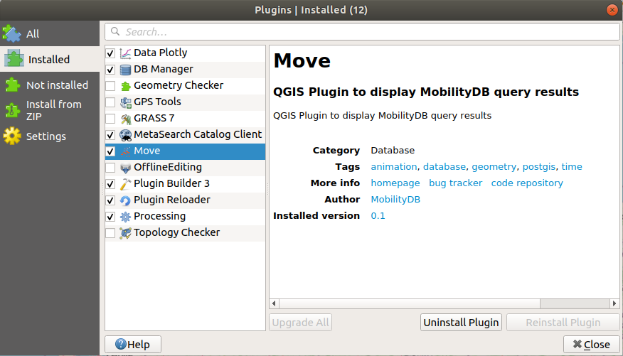

# Move

QGIS Plugin to display MobilityDB query results

This plugin allows users to query [MobilityDB](https://github.com/MobilityDB/MobilityDB) databases using SELECT statements, and display the resulting spatial and spatio-temporal columns as QGIS layers.

## Prerequisites

 - [QGIS](https://www.qgis.org/en/site/)
 - [MobilityDB](https://github.com/MobilityDB/MobilityDB)
 - [Python](https://www.python.org/)

## Installation steps

Installing the plugin is done locally using the [Plugin Builder Tool](http://g-sherman.github.io/plugin_build_tool/).

 1. Clone the [Move github repository](https://github.com/mschoema/move) (or download and unzip the project) in the directory of your choice.
 2. Install the [Plugin Builder Tool](http://g-sherman.github.io/plugin_build_tool/).
 3. Open a terminal in the [move](https://github.com/mschoema/move/tree/master/move) directory and run the following command:
```shell
pbt deploy -y
```
 4. In QGIS, go to Plugins->Manage and Install Plugins->Installed, and check the box next to the plugin.



## Using the plugin

### Plugin interface

The plugin has a simple interface that can be opened using Database->Move->Open Move Interface, or using the button in the top toolbar.

When opened, the plugin is displayed as a widget at the bottom of the QGIS window, and it has 4 elements:

 1. A combobox to select the database to use.
 2. A textbox to write SQL SELECT queries.
 3. An *Execute Query* button.
 4. A *Refresh Layers* button.


### Database connection

The plugin detects existing PostGIS database connections, and lists them in its combobox.  
When executing a query, the plugin will use the database connection currently selected in the combobox.  
To refresh the available databases, simply close and re-open the plugin.

#### Database requirements

To work correctly, the plugin requires these database connections to have their username and password stored.  
Additionally, to handle the database backend correctly, the plugin needs to be run in a project with a defined title.  
To define the title of the project, go to Project->Properties->General->Project Title.

### Execute Query

To use the plugin, simply write a SELECT query in the textbox and press the *Execute Query* button to execute it.  
The plugin will create layers for each spatial or spatio-temporal column returned by the query.  

Since some queries can be long to execute, all queries are run in the background.  
Checking if a query is still being run can be done by looking at the running tasks at the bottom of the QGIS window.  
When the query execution is completed, the plugin will create the appropriate layers in QGIS.  
This last step might freeze the QGIS window for a moment, but this should only take a few seconds.

**BE CAREFUL: Writing queries that return millions of lines might crash QGIS.**  
Use a LIMIT at the end of the query to restrict the amount of features created.


#### PostGIS geometries

PostGIS geometry columns create up to three layers depending on the geometry types present in the column:

 - *MultiPoint* layer if there are *Point* or *MultiPoint* geometries in the column
 - *MultiLineString* layer if there are *LineString* or *MultiLineString* geometries in the column
 - *MultiPolygon* layer if there are *Polygon* or *MultiPolygon* geometries in the column

#### MobilityDB temporal points

MobilityDB *tgeompoint* or *tgeogpoint* columns will result in a QGIS layer each.  
These layers are marked as temporal, and can be explored using the temporal controller in QGIS. (View->Panels->Temporal Controller Panel)  
For a fluid animation, set the step to a small interval and the frame rate to 60.

### Refresh Layers

The layers are related to the query that created them, but they are not updated automatically when the initial tables used in the query are updated. Running the *Refresh Layers* button will refresh the layers by re-executing the queries that created them.

## Issues and ideas

For any issues or improvement ideas, open a new git issue or send an email to maxime.schoemans@ulb.be

## License

Move is licensed under the terms of the MIT License (see the file
[LICENSE](https://github.com/mschoema/move/blob/master/LICENSE)).
